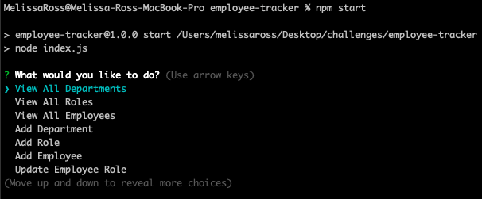
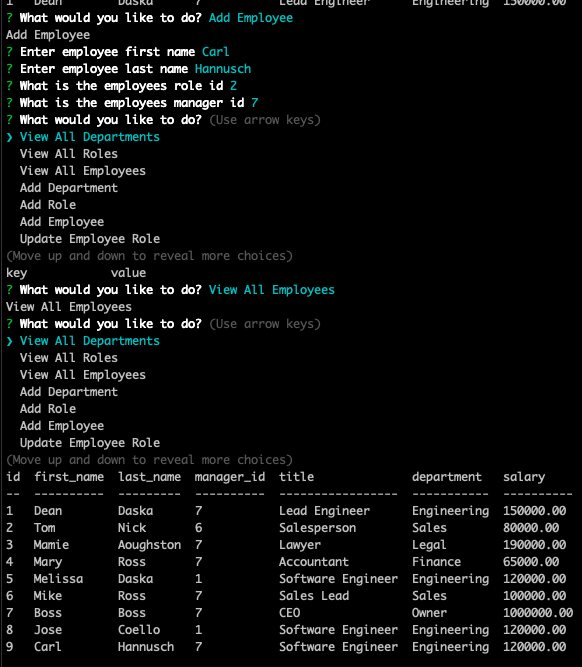
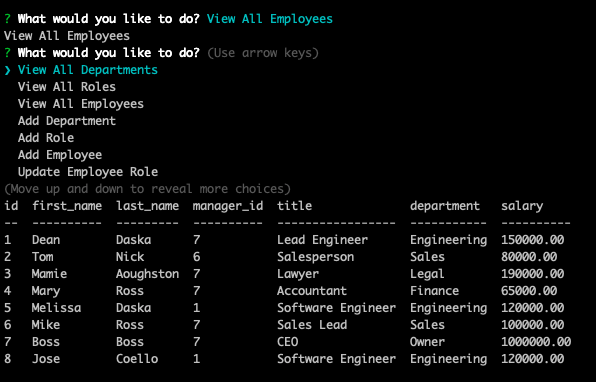

# Employee Tracker

Follow this link that demonstrates the functionality of the Employee Tracker! [Employee Tracker Walkthrough Video]()

  ## Table of Contents
  
  * [Description](#description)
  * [Screenshots](#screenshots)
  * [Usage](#usage)
  * [Questions](#questions)

## Description

This is a command line input application to manage a company's employee database using Node.js, Inquirer, and MySQL. This is great for Business Owner's who want to view and manage their departments, roles and employees in their company so they can organize and plan their businesses.

## Screenshots
Here is a screenshot displaying questions promping the user: 

Here is a screen showing an example of how to add an employee:

Here is a screen showing the list of employees which includes the new employee that was added:

## Usage
Launch terminal, run command npm start, answer the questions about your employees. You can even add and update employees!

## Questions
If you have any questions, you can reach me by emailing [melissa.daska@gmail.com](mailto:melissa.daska@gmail.com) or follow the link to my gitHub profile [melissadaska](https://github.com/melissadaska).
